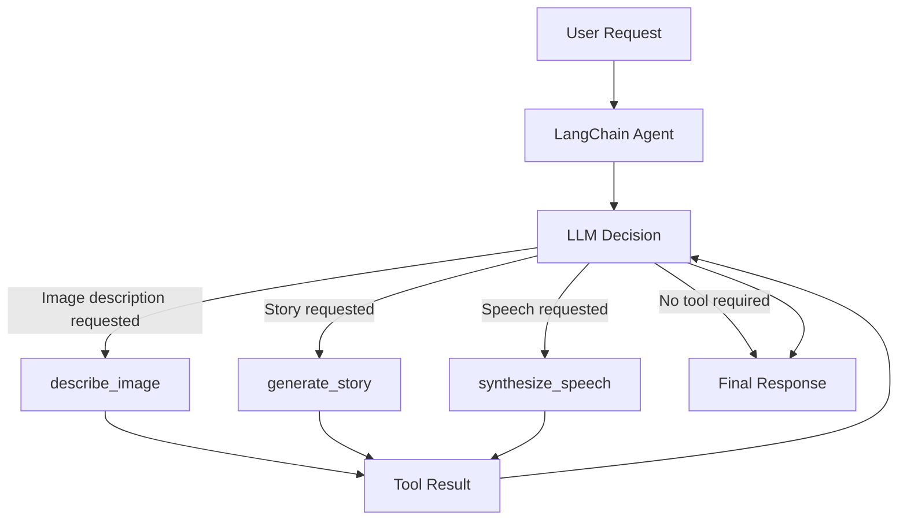
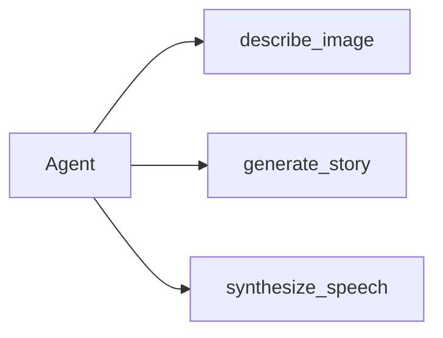
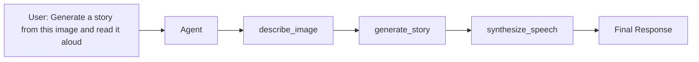

# AgentFlow

A LangChain-based AI agent demonstrating dynamic tool orchestration, streaming, runtime context injection, and thread-level conversation memory.
## Core Capabilities

* Dynamic tool selection based on user intent
* Independent and sequential tool execution
* Multi-step tool orchestration
* Real-time token streaming
* Thread-level conversational memory
* Runtime context injection with `ToolRuntime`
* Separation between agent orchestration and tool implementation
* Language-aware story generation and speech synthesis

## Agent Architecture

The three tools are independent capabilities exposed to the agent. There is no fixed workflow.

The agent selects only the tools required for the current request.



Each tool can be called independently when its required input is already available.



When one operation depends on the result of another, the agent executes the tools sequentially.



The sequence is therefore determined by the request and data dependencies, not by a hard-coded pipeline.

## Available Tools

### `describe_image`

Analyzes the image supplied through the runtime context and returns a concise description of its visible content.

The tool uses a multimodal language model and avoids inventing unsupported details.

Example request:

```text
Describe this image.
```

Execution:

```text
Agent → describe_image → Final response
```

### `generate_story`

Generates a complete story from a user-provided prompt, an image description, or information available in the conversation.

The tool can be called directly and does not require the image-description tool.

Example request:

```text
Write a short mystery story about an abandoned railway station.
```

Execution:

```text
Agent → generate_story → Final response
```

### `synthesize_speech`

Converts supplied text into speech and saves the generated audio to the output path provided through the runtime context.

The tool can be called directly when the text is already available.

Example request:

```text
Convert this sentence to speech: Welcome to AgentFlow.
```

Execution:

```text
Agent → synthesize_speech → Final response
```

## Dynamic Tool Orchestration

AgentFlow does not automatically run all tools for every request.

The system prompt instructs the agent to:

* Select only the tools required by the user
* Call a tool directly when all required inputs are available
* Execute prerequisite tools first when another tool depends on their output
* Avoid unnecessary tool calls
* Call independent tools together only when their inputs are already available

Examples:

| User request                                       | Expected tool execution                                   |
| -------------------------------------------------- | --------------------------------------------------------- |
| Describe this image                                | `describe_image`                                          |
| Write a story about a robot                        | `generate_story`                                          |
| Convert this text to speech                        | `synthesize_speech`                                       |
| Generate a story from this image                   | `describe_image` → `generate_story`                       |
| Generate a story from this image and read it aloud | `describe_image` → `generate_story` → `synthesize_speech` |
| Rewrite the previous story in English              | `generate_story` using conversation history               |
| Read the previous story aloud                      | `synthesize_speech` using conversation history            |

## Streaming and Final Response Handling

AgentFlow uses two LangGraph streaming modes for separate responsibilities:

* `messages` streams model-generated text incrementally for real-time display
* `updates` captures the completed final `AIMessage`

This avoids reconstructing the final answer solely by concatenating streamed tokens.

```python
for event in self._agent.stream(
    agent_input,
    context=context,
    config=config,
    stream_mode=["messages", "updates"],
    version="v2",
):
    ...
```

Streaming output is displayed as it is generated, while the completed final response remains available to the application after execution.

## Conversation Memory

The agent uses LangGraph's `InMemorySaver` with a thread identifier.

```python
config = {
    "configurable": {
        "thread_id": thread_id,
    }
}
```

Messages produced within the same thread are retained, allowing the agent to understand follow-up requests such as:

```text
Make the previous story shorter.
```

```text
Translate it into Chinese.
```

```text
Read it aloud.
```

Different thread IDs create isolated conversations.

The current implementation uses in-memory checkpointing for local demonstration. Conversation state is cleared when the application process ends.

## Runtime Context

Application-controlled values are provided to tools through `AgentContext` and `ToolRuntime`.

```python
@dataclass(frozen=True)
class AgentContext:
    image_path: str
    output_path: str
```

The image-description tool obtains the image path from the runtime context:

```python
image_path = runtime.context.image_path
```

The speech-synthesis tool obtains its output location in the same way:

```python
output_path = runtime.context.output_path
```

This prevents the language model from inventing or directly controlling application-level file paths.

It also separates two different types of information:

* Tool arguments represent values the model may determine
* Runtime context represents trusted values supplied by the application

## Code Structure

```text
AgentFlow/
├── agents.py
├── agent_context.py
├── agent_tools.py
├── config.py
├── main.py
├── models.py
├── prompt.py
├── requirements.txt
│
├── data/
│   └── example.png
│
├── output/
│   └── output.mp3
│
└── tools/
    ├── image_description.py
    ├── story_generation.py
    └── speech_synthesize.py
```

### `agents.py`

Creates and runs the LangChain agent.

Responsibilities include:

* Registering tools
* Configuring the system prompt
* Enabling conversation checkpointing
* Passing runtime context
* Streaming model output
* Extracting the final response

### `agent_tools.py`

Defines the tools exposed to the language model.

This layer converts service implementations into LangChain tools and defines the tool descriptions and model-visible arguments.

### `agent_context.py`

Defines trusted runtime values that are supplied by the application rather than generated by the model.

### `tools/`

Contains the implementation of each capability:

* Image analysis
* Story generation
* Speech synthesis

### `prompt.py`

Contains separate system prompts for:

* Agent tool orchestration
* Image description
* Story generation

### `models.py`

Encapsulates model configuration and language-model calls.

### `main.py`

Provides a command-line interface for testing multi-turn conversations within the same thread.

## Design Decisions

### Independent tools instead of a fixed pipeline

The tools are not permanently connected in the order:

```text
describe_image → generate_story → synthesize_speech
```

That sequence is used only when the user's request requires all three operations.

This allows the same agent to support both direct and composite requests without creating separate workflows for every possible combination.

### Application context is separate from model input

File paths are supplied by the application through runtime context instead of being exposed as model-generated tool arguments.

This provides clearer ownership of trusted application data.

### Tool definitions are separate from implementations

LangChain tool wrappers are defined in `agent_tools.py`, while the underlying implementations live in `tools/`.

This keeps framework-specific orchestration separate from the actual capabilities.

### Final responses are not reconstructed from every model token

Streamed tokens are used for presentation, while completed model updates are used to identify the final answer.

This avoids combining intermediate model outputs with the final response.

### Conversation state is isolated by thread

A thread ID identifies one conversation. Reusing the same thread preserves context, while a new thread starts an independent interaction.

## Example Interaction

```text
User:
Generate a story based on this image.

Assistant:
A small dog waited beside the quiet lake...

User:
Make it more mysterious.

Assistant:
As the mist settled over the lake, the small dog noticed...

User:
Read it aloud.

Assistant:
The story has been converted to speech.
```

Possible execution:

```text
Turn 1:
describe_image
→ generate_story
→ final response

Turn 2:
generate_story using conversation context
→ final response

Turn 3:
synthesize_speech using conversation context
→ final response
```

## Current Technology Stack

* Python
* LangChain
* LangGraph checkpointing and streaming
* OpenAI language and multimodal models
* gTTS
* Python dataclasses
* Environment-based configuration

## Planned Improvements

The current version focuses on tool orchestration, streaming, runtime context, and conversational state.

Planned engineering improvements include:

* Human-in-the-loop approval and resume workflows
* Structured agent execution results
* Tool-call tracing and latency measurement
* Token-usage reporting
* Tool error handling and recovery
* Automated evaluation of tool-selection accuracy
* Persistent checkpoint storage
